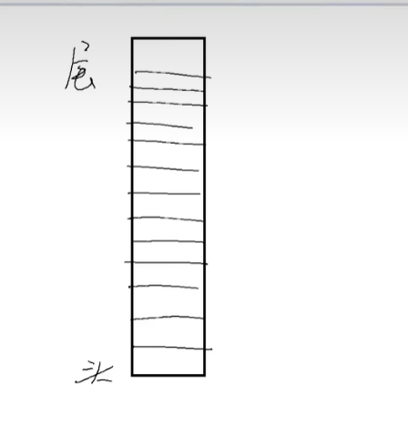
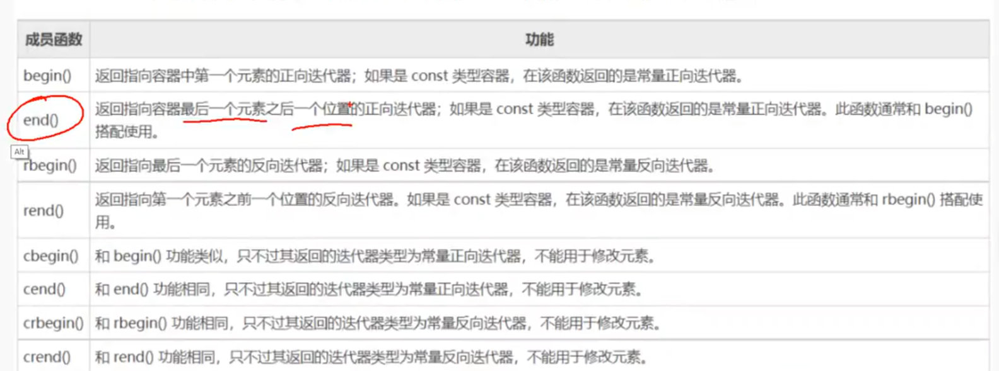
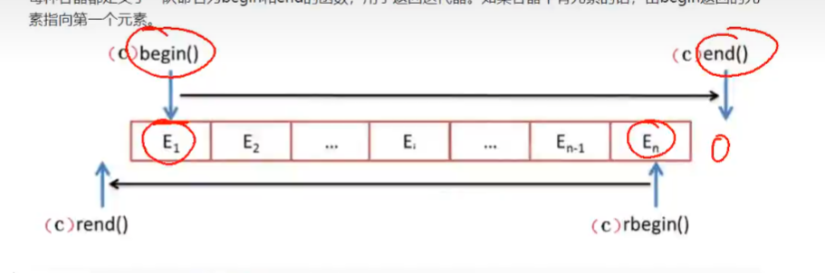
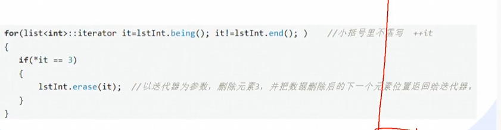

# STL

## 1.基本概念

**一个C++标准模板库，有算法，容器，迭代器，容器和算法通过迭代器无缝的连接。**

STL被组织成13个头文库：

```
<algorithm>、<deque>、<functional>、<iterator>、<vector>、<list>、<map>、<memory>、<numeric>、<queue>、<set>、<stack>、<utility>.
```

优点：

1）在编译器内，不需要额外安装。

2）数据结构和算法分离。例如在vector容器中可以放入元素，基础数据类型变量，元素的地址。

3）不用考虑STL的具体实现过程。

4）具有高可重用性，高性能，高移植性，跨平台。

高可重用性：几乎所有的代码都采用了模板类和模板函数。

高性能：比如map是采用红黑树的变体实现的。

高移植性：A项目上编写的模块可直接移植到B项目上。

跨平台：visual studio上的代码可以直接在Mac Os的XCode上直接编译。


## 2.容器

1) 序列式容器 （Sequence containers)

* 每个元素都有固定位置，取决于插入时机和地点吗，和元素值无关。

* vector、deque、list、stack、queue

2) 关联式容器  (Associated containers)

* 元素位置取决于特定的排序准则，和插入顺序无关

* set、multiset、map、multimap

  

| 数据结构                 | 描述                                                         | 实现头文件 |
| ------------------------ | ------------------------------------------------------------ | ---------- |
| 向量(vector)             | 连续存储的元素                                               | <vector>   |
| 列表(list)               | 由节点组成的双向链表，每个节点包含一个元素                   | <list>     |
| 双队列(deque)            | 连续存储的指向不同元素的指针所组成的数                       | <deque>    |
| 集合(set)                | 由节点组成的红黑树，每个节点包含一个元素，节点之间以某种作用于元素对的谓词排列，没有两个不同的元素能够拥有相同的次序 | <set>      |
| 多重集合(multiset)       | 允许存在两个次序相等的元素的集合                             | <set>      |
| 栈(stack)                | 先进后出的值的排列                                           | <stack>    |
| 队列(queue)              | 先进先出的值的排列                                           | <queue>    |
| 优先队列(priority queue) | 元素的次序是由作用于所存储的值对上的某种谓词决定的一种队列   | <queue>    |
| 映射(map)                | 由{键，值}对组成的集合，以某种作用于键对上的谓词排序         | <map>      |
| 多层映射(multimap)       | 允许键对有相等的次序的映射                                   | <map>      |


### 2.1 vector 容器

###### 1） 简介

* vector是将元素置于一个动态数组中加以管理的容器。

* 可以随机存取元素(索引值存取，[]操作数，at()方法)

* vector尾部添加或移除元素非常快速。但是在中部或头部插入元素或移除元素比较费时。

  

###### 2） vector采用模板类实现，vector对象的默认构造形式

```
vector<T> vecT;

vector<int> vecInt;
vector<float> vecFloat;
vector<string> vecString;
...
class CA{};
vector<CA*> vecpCA;
vector<CA> vecCA;
```


###### 3） vector对象的带参数构造

理论知识

* vector(beg,end);  // 构造函数将[beg,end]区间的元素拷贝给本身。注意该区间是左闭右开的区间。beg,end是指针

* vector(n,elem); //构造函数将n个elem拷贝给本身

* vector(const vector &vec); //拷贝构造函数

  代码示例

  ```
  #include<iostream>
  #include<vector>
  using namespace std;
  
  template<typename T>  //vector(beg,end)的模板实现
  vector<T> vector_beg_end(T* arr,int size)
  {
  	vector<T> vecT(arr, arr + size);
  	return vecT;
  }
  
  template<typename T> //vector(n,elem)的模板实现
  vector<T> vector_n_elem(int n, T elem)
  {
  	vector<T> vecT(n, elem);
  	return vecT;
  }
  
  template<typename T> //vector(const vector &vec)的拷贝实现
  vector<T> vector_copy(const vector<T> &src )
  {
  	vector<T> vecT(src);
  	return vecT;
  }
  
  template<typename T>  //重载vector容器的<<运算符
  std::ostream& operator<<(std::ostream& out, const std :: vector<T>& src)
  {
  	for (auto it = src.begin(); it != src.end(); ++it)
  	{
  		out << *it << " ";
  	}
  	out << endl;
  	return out;
  }
  
  int main()
  {
  	int arr[5] = {1,2,3,4,5};
  	vector<int> example = { 1,2,3,4,5 };
  	cout<<vector_beg_end(arr, sizeof(arr) / sizeof(arr[0]));
  	cout<<vector_n_elem(3, 'a');
  	cout << vector_copy(example);
  	return 0;
  }
  ```

  结果

  ```
  1 2 3 4 5
  a a a
  1 2 3 4 5
  ```

  

###### 4） vector赋值

* vector.assign(beg,end); //将[beg,end)区间的元素赋值给本身，左闭右开

* vector.assign(n,elem);//把n个elem拷贝赋值给本身

* vector& operator=(const vector &vec)//重载等号运算符

* vector.swap(vec)；//把vec与本身的元素互换

  

```
template<typename T>
void vector_copy_to(const vector<T>& src)
{
	char arr[5] = {'a','r','r','0','1'};
	vector<T> vecA;  # 创建四个vector
	vector<T> vecB;
	vector<T> vecC;
	vector<T> vecD;
	
	//vector.assign(beg,end); 
	vecA.assign(arr,arr + sizeof(arr) / sizeof(arr[0])); 
	vecB.assign(src.begin(), src.end());
	
	//vector.assign(n,elem);
	vecC.assign(5, 'B');
	
	//vector& operator=(const vector &vec)
	vecD = vecA;
	
	cout << "vecA.assign( 'a', 'r', 'r', '0', '1')" << vecA;
	cout << "vecB.assign(src.begin,src.end)" << vecB;
	cout << "vecC.assign( 5,B)" << vecC;
	cout << "vecD = vecA;" << vecD;
	
	//vector.swap(vec)；
	vecD.swap(vecC);
	
	cout << "after swap D C" << endl;
	cout << "vecC" << vecC;
	cout << "vecD" << vecD;
}
```

结果

```
vecA.assign( 'a', 'r', 'r', '0', '1')	a r r 0 1
vecB.assign(src.begin,src.end)			B B B B B
vecC.assign( 5,B)						B B B B B
vecD = vecA;							a r r 0 1
after swap D C
vecC									a r r 0 1
vecD									B B B B B
```


###### 5）vector的大小

理论知识

* vector.size();//返回容器中元素的个数

* vector.empty();//判断容器是否为空

* vector.resize(num);//重新指定容器的长度为num,若容器变长，则以默认值填充。若变短则删除超出部分。

* vector.resize(num，elem);//重新指定容器的长度为num,若容器变长，则以elem填充。若变短则删除超出部分。

  

```

template<typename T>
void vector_size(vector<T> &src)
{
	cout << "src.size  src.empty(): " << src.size()<<"  " << src.empty() << endl;
	src.resize(4);
	cout << "src.resize(4):" << src;
	cout << "src.size  src.empty(): " << src.size() << "  " << src.empty() << endl;
	src.resize(0);
	cout << "scr.resize(0):" << src;
	cout << "src.size  src.empty(): " << src.size() << "  " << src.empty() << endl;
	src.resize(4, 5);
	cout << "scr.resize(4,5):" << src;
	cout << "src.size  src.empty(): " << src.size() << "  " << src.empty() << endl;
}
```

结果

```
src.size  src.empty(): 0  1
src.resize(4):0 0 0 0
src.size  src.empty(): 4  0
scr.resize(0):
src.size  src.empty(): 0  1
scr.resize(4,5):5 5 5 5
src.size  src.empty(): 4  0
```

###### 6) vector末尾的添加移除操作

* vector<int> vecInt;

* vecInt.push_back(1);//在容器尾部加入一个元素

* vecInt.push_back(3)

* vecInt.push_back(5)

* vecInt.push_back(7)

* vecInt.push_back(9)

* vecInt.pop_back();  //末尾移除一个元素

* vecInt.pop_back();

  

###### 7） vector元素的访问方式

使用下标访问

```
int a[]={1,2,3,4};

vector<int> v1(a,a+4);
for(int i=0;i<v1.size();i++)
	cout<<v1[i]<<" ";
cout<<end;
v1[8]=100;  //下标越界可能导致程序异常终止
```

理论知识

* vec.at(idx);//返回索引idx所指的数据，如果idx越界，抛出out_of_range异常。

* vec[idx];//返回索引idx所指的数据，越界时，运行直接报错。

  

```
vector<int> vecInt  // 1,3,5,7,9
vecInt.at(2)==vecInt[2]; //5
vecInt.at(2)=8;
vecInt //1,3,8,7,9

int iF=vector.front(); //1
int iB=vector.back(); //9
vector.front()=11;
vector.back()=19;
vecInt //11,3,8,7,19
```


###### 8) vector的插入

理论知识

* vector.insert(pop,elem) //在pos位置插入一个elem元素的拷贝，返回新元素的位置。

* vector.insert(pos,n,elem);//在pos位置插入n个elem数据，无返回值

* vector.insert(pos,beg,end) ；在pos位置插入[beg,end)区间的数据，无返回值

  第一个位置不能为下标，应该为指针。

  案例

  

```
vector<int> vecA;
vector<int> vecB;

vecA.push_back(1);
vecA.push_back(3);
vecA.push_back(5);
vecA.push_back(7);
vecA.push_back(9);  // vecA 1,3,5,7,9

vecB.push_back(2);
vecB.push_back(4);
vecB.push_back(6);
vecB.push_back(8);
vecB.push_back(10);  // vecB 2,4,6,8,10

vecA.insert(vecA.begin()+3,100); // vecA 1,3,5,100,7,9
vecB.insert(vecB.begin()+2,50); // vecA 2,4,50,6,8,10
vecA.insert(vecA.begin()+2,3,88);//1,3,88,88,88,5,100,7,9
vecA.insert(vecA.begin()+1,vecB.begin(),vecB.end());
//1,2,4,50,6,8,10,3,88,88,88,5,100,7,9
```

结果

```
vecA:1 3 5 7 9
vecB:2 4 6 8 10
vecA:1 3 5 100 7 9
vecB:2 4 50 6 8 10
vecA:1 3 88 88 88 5 100 7 9
vecA:1 2 4 50 6 8 10 3 88 88 88 5 100 7 9
```


###### 9）vector的删除

* vector.erase(pos) //删除pos指针的对应元素，容器size自动-1；

* vector.pop_back()//删除末尾元素。可以用swap将要删除的元素与末尾元素交换后使用pop_back删除。

  ```
  vector<int> vecInt={1,2,3,4,5};
  vecInt.erase(vecInt.begin()+2); //1,2,4,5
  vecInt.pop_back(); //1,2,4;
  swap(vecInt[0],vecInt[2]);
  vecInt.pop_back(); //4,2;
  ```

  

###### 迭代器

**迭代器的基本概念**

###### 迭代器是一种检查容器内元素并且遍历容器内元素的数据类型

**迭代器的作用**

迭代器提供对一个容器中的对象的访问方法，并且定义了容器中对象的范围。

```
vector<int> vecIntA;
veint array[]={0,1,20,30,40};

vecIntA.assign(array,array+5);
cout<<vecIntA[3]<<endl;
cout<<vecIntA.at(3)<<endl;
```

为什么需要迭代器

* STL提供每种容器的实现原理各不相同，如果没有迭代器我们需要记住每一种容器中对象的访问方法，很显然这样会变得非常麻烦
* 每个容器中都实现了一个迭代器用于对容器中对象的访问，虽然每个容器中的迭代器的实现方式不一样，但是对于用户来说操作方法是一致的，也就说通过迭代器统一了对所有容器的访问方式。例如：无论哪个容器，访问当前元素的下个元素我们可以通过迭代器自增进行访问
* 迭代器是为了提高变成效率开发的


###### **vector容器的迭代器**

* vector<int>::iterator iter;//变量名为iter

* vector容器的迭代器属于随机访问迭代器，迭代器可以一次移动多个位置

  ```
  vector<int> vecIntA;
  int array[] = { 0,1,20,30,40 };
  vecIntA .assign(array,array+5);
  vector<int>::iterator iter = vecIntA.begin();
  for (iter = vecIntA.begin(); iter != vecIntA.end(); iter++)
  {
  	cout << *iter<<" ";
  }
  cout << endl;
  iter = vecIntA.begin() + 2;
  *iter = 0;
  for (iter = vecIntA.begin(); iter != vecIntA.end(); iter++)
  {
  	cout << *iter<<" ";
  }
  cout << endl;
  ```

  结果

  ```
  0 1 20 30 40
  0 1 0 30 40
  ```

  不仅可以自增还可以自减iter = iter-2;

迭代器的成员函数




begin和end操作



* begin为指向容器第一个元素的指针，指向尾部的方向
* end为指向最后一个元素的后一个指针，指向尾部的方向
* rbegin为指向容器最后一个元素的指针，指向头部的方向
* rend为指向容器第一个元素前一个元素的指针，指向头部的方向


###### 迭代器失效

情形

```
vector<int> v;
int array[]={1,2,3,4};
v.assign(v,v+4);

vector<int>::iterator iter=v.begin+3;
v.insert(iter,8);
cout<<*iter<<endl;
```

在该情形中一个容器在insert后可能需要扩容，扩容需要new一块新的空间，然后把数据迁移过去，迭代器内部通过指针访问呢内容，插入后，vector扩容，原有的数据被释放，指向原有数据的迭代器成为了野指针，所以迭代器失效了。旧的空间有可能储存新的数据。导致访问的错误

即迭代器指向的空间被释放了


insert函数会返回一个新的有效的迭代器

| 1    | 2    | 3    | 4    | 1    | 2    | 3    | 8    | 4    |      |      |
| ---- | ---- | ---- | ---- | ---- | ---- | ---- | ---- | ---- | ---- | ---- |
|      |      |      | iter |      |      |      | iter |      |      |      |

这是例子中左lter是原先迭代器指向的位置，右iter是insert后返回的迭代器指向的位置。

使用iter=insert(iter,8)可以避免迭代器失效


例子2

```
vector<int> cont={1,2,3,3,3,4,5,5,5,6};
vector<int>::iterator iter;
for(iter=cont.begin();iter=cont.end();iter++)
{
if(*iter==3)
	cont.erase(iter);
}
```

visual studio编译会报错，删除后会使后面所有元素的iterator都失效。这是因为vector,deque使用了连续分配的内存，删除一个元素导致后面所有的元素会向前移动一个位置。不能使用erase(iter++)的方式。

逻辑的输出

```
1 2 3 4 5 5 5 6  实际编译错误
```

但erase可以返回下一个有效的iterator

如下面的例子

```
vector<int> cont={1,2,3,3,3,4,5,5,5,6};
vector<int>::iterator iter;
for(iter=cont.begin();iter=cont.end();)
{
if(*iter==3)
	iter=cont.erase(iter);
else
	iter++;
}
```

结果

```
1 2 4 5 5 5 6
```

用表格表示过程

| 1    | 2    | 3    | 3    | 3    | 4    | 5    | 5    | 5    | 6    |
| ---- | ---- | ---- | ---- | ---- | ---- | ---- | ---- | ---- | ---- |
| 1    | 2    | 3    | 3    | 4    | 5    | 5    | 5    | 6    |      |
|      |      | iter |      |      |      |      |      |      |      |
| 1    | 2    | 3    | 4    | 5    | 5    | 5    | 6    |      |      |
|      |      | iter |      |      |      |      |      |      |      |
| 1    | 2    | 4    | 5    | 5    | 5    | 6    |      |      |      |
|      |      | iter |      |      |      |      |      |      |      |

iter为删除后返回的迭代器。


### 2.2 deque容器

* deque是double-ended queue的缩写，和vector一样都是STL的容器

* deque是单端数组，而vector是双端数组

* deque与vector的接口非常相似，在许多操作的地方可以直接替换

* deque可以随机存取数组

* deque的头部和尾部添加和移除数据非常迅速，但在中间比较缓慢

* #include<deque>

  

###### deque容器的操作

**deque与vector在操作上几乎一样，deque多两个函数**

* deque.push_front(elem);在容器头部插入一个数据

* deque.pop_front();删除容器第一个数据

  

代码示例

```
template<typename T>
void deque_push_pop(deque<T> src)
{
	cout << src;
	src.push_front(100);
	cout << src;
	src.pop_front();
	cout << src;
	src.erase(src.begin());
	cout << src;
}

template<typename T>
std::ostream& operator<< ( std::ostream &out , std::deque<T>& src)
{
	typename deque<T>::iterator iter = src.begin();
	for (; iter != src.end(); ++iter)
	{
		out << *iter << "  ";
	}
	out << endl;
	return out;
}

int main()
{
	deque<int> deqInt= { 1,2,3,4,5 };
	deque_push_pop(deqInt);
}
```

```
结果
 1 2 3 4 5
 100 1 2 3 4 5
 1 2 3 4 5
 2 3 4 5
```

erase的效率在此处没有太大区别，头部建议使用pop_front

deque容器也可以使用下标法表示，不过数据在内存中是不连续的，而在运算符重载时找到方法使内存读取变得连续。


### 2.3 list容器

* list容器是一个双向链表容器，可以高效的插入删除元素

* 不可以随机存取元素，不支持at.(pos)函数和[]操作符

  支持Iter++

  不支持Iter+5

*  #include<list>


list对象的默认构造

```
list<int> listInt;
list<float> listFloat;
list<string> listString;

```


###### 1）list的头尾添加移除操作

* list.push_back(elem);//在容器尾部加入一个元素

* list.pop_back(); //在容器尾部删除一个元素

* list.push_front)；//容器头部插入一个元素

* list.pop_front；//容器头部删除一个元素

  

示例

```

template<typename T>
void list_create_push_pop(list<T> &src)
{
	src.push_back(10);
	src.push_back(20);
	src.push_back(30);
	cout << src;
	src.pop_back();
	cout << src;
	src.push_front(1);
	src.push_front(2);
	src.push_front(3);
	cout << src;
	src.pop_front();
	cout << src;
	cout << src.front() << endl;
	cout << src.back() << endl;
	src.front() = 100;
	cout<<src.front;
}

int main()
{
	list<int> listInt;
	list_create_push_pop(listInt);
}
```

```
结果
10 20 30
10 20
3 2 1 10 20
2 1 10 20
2
20
100
```


###### 2) list容器的迭代器

* list容器的迭代器是''双向迭代器 ":双向迭代器从两个方向读写容器。除了提供前向迭代器的全部操作外，双向迭代器还提供前置和后置的自减运算。

迭代器获取

list.begin();// 返回容器中第一个元素的迭代器

list.end(); //返回容器中最后一个元素之后的迭代器

list.rbegin(); // 返回容器中倒数第一个元素的迭代器

list.rend();//返回容器中倒数最后一个元素的后的迭代器

示例

```
template<typename T>
void list_iterator(list<T>& src) // 1 2 3 4 5
{
	typename list<T>::iterator iter_begin = src.begin();
	for (; iter_begin != src.end(); iter_begin++)
		cout << *iter_begin << " ";
	cout << endl;

	typename list<T>::reverse_iterator iter_rbegin = src.rbegin();
	for (; iter_rbegin != src.rend(); iter_rbegin++)
		cout << *iter_rbegin << " ";
	cout << endl;

}
```

```
结果
1 2 3 4 5
5 4 3 2 1
```


###### 2) list对象带参数构造

* list(n,elem); // 构造函数将n个elem拷贝本身
* list(beg,end); // 构造函数将[beg,end)区间中的元素拷贝给自身
* list(const list &lst); //拷贝构造函数

```
template<typename T>
list<T> create_list(list<T> &src)
{
	list<T> lst1(4, 'm');
	cout << lst1;
	list<T> List = { 'a','b','c','d','e' };
	auto iter_beg = List.begin();
	iter_beg++;
	auto iter_end = List.begin();
	iter_end++;
	iter_end++;
	list<T> lst2(iter_beg,++iter_end);
	cout << lst2;
	list<T> lst3(List3
	cout << lst3;
	return lst3;
}
```

```
结果 
m m m m
b c
a b c d e
```


###### 3) list容器的赋值

* list.assign(beg,end)   //把[beg,end)区间中的数据拷贝给本身
* list.assign(n,elem)  // 把n个elem拷贝给本身
* list& operator=(const list &lst)  //重载运算符=
* list.swap(lst)  //把lst和本身的元素呼唤

示例


```
template<typename T>
void list_copy(list<T>& src)
{
	list<T> lst1 = { 1,2,3,4,5 };
	src.assign(5, 5);
	cout << src;
	src.swap(lst1);
	cout << src;
	src.assign(lst1.begin(), --lst1.end());
	cout << src;
	src = lst1;
	cout << src;
}
```

结果

```
5 5 5 5 5
1 2 3 4 5
5 5 5 5
5 5 5 5 5
```


4）list容器的大小

* list.size();// 返回容器中元素的个数
* list.empty(); //判断容器是否为空
* list.resize(num); //重新指定容器的长度为num,若变成，则填充默认值，若变短，则删除超出部分
* list.resize(num,elem); // 若变成则填充elem

示例

```
template<typename T>
void list_size(list<T> &src)
{
cout<<src.empty()<<src.size()<<endl;
src.resize(5)
cout<<src.empty()<<src.size()<<endl;
cout<<src;
src.resize(7,1);
cout<<src.empty()<<src.size()<<endl;
cout<<src;
src.resize(4);
cout<<src.empty()<<src.size()<<endl;
cout<<src;
}
```

```
结果
1 0
0 5
0 0 0 0 0
0 7
0 0 0 0 0 1 1
0 4
0 0 0 0
```


###### 5) list容器的插入

* list.insert(pos,elem); //在pos位置插入elem元素的拷贝，返回新数据的位置
* list.insert(pos,n,elem);  //pos位置插入n个elem元素的拷贝。无返回值
* list.insert(pos,beg,end);  //pos位置插入[beg,end)之间的数据，无返回值

pos是指针


示例

```
template<typename T>
void list_insert(list<T> &src)
{
list<T> lst={1,2,3,4,5};
src.assign(5,5);
cout<<src;
src.insert(++src.begin(),10);
cout<<src;
src.insert(++(++src.begin()),3,8);
cout<<src;
src.insert(src.begin(),lst.begin(),lst.end());
cout<<src;
}
```

代码

```
5 5 5 5 5
5 10 5 5 5 5
5 10 8 8 8 5 5 5 5
1 2 3 4 5 5 10 8 8 8 5 5 5 5
```

选择指定位置

```
typename list<T>::iterator iter=src.begin();
for(;*iter!=target;iter++)
{
;
}
```

和vector容器不同的是，list容器在插入后不会导致迭代器失效（list容器是链表结构）


6） insert容器的删除

* list.clear();  //移除容器的所有数据
* list.erase(beg,end);  //删除[beg,end)区间的数据，返回下一个数据的位置
* list.erase(pos);  //删除pos位置的数据，返回下一个数据的位置
* list.remove(elem);删除容器中所有elem值

实例

```
template<typename T>
void list_delete(list<T> &src)
{
src={1,2,3,4,5,4,5,6};
cout<<src;
src.erase(src.begin());
cout<<src;
src.erase(--(--src.end()),src.end());
cout<<src;
src.remove(4);
cout<<src;
src.clear();
cout<<"after clear list empty? "<<src.empty()<<endl;
}
```

结果

```
1 2 3 4 5 4 5 6
2 3 4 5 4 5 6
2 3 4 5 4
2 3 5
after clear list empty? 1
```


7） list容器的反转

* list.reverse() //如lst它包含1,3,5运行该方法后就包含5，3，1

  ```
  template<typename T>
  void list_reverse(list<T> src)
  {
  cout<<src;
  src.reverse();
  cout<<src;
  }
  ```

  结果

  ```
  1 2 3 4 5
  5 4 3 2 1
  ```

可以用reverse_iterator达到相同的效果


###### 8）list容器迭代器失效

* 删除节点导致迭代器失效

  

```
template<typename T>
void list_iterator_useless_delete(list<T> &src)
{
cout<<src;
typename list<T>::iterator iter=src.begin();
for(;iter!=src.end();)
{
if(*iter==2)
iter=src.erase(iter);
else
iter++;
}
cout<<src;
}
```

结果

```
2 3 3 4 2 2 6 7
3 3 4 6 7
```

注意不能在erase(iter)之后再做iter++,因为iter已经被释放找不到next指针


### 2.4 stack容器


###### 1）stack容器简介

* stack是堆栈容器，是一种'先进后出’的容器。
* include<stack>


###### 2) stack对象的默认构造

* stack采用模板类实现，默认构造形式为 stack<T> s;
* stack<int> stkInt； //一个存放int的stack容器
* stack<float> stkFloat;  //一个存放float容器的stack容器
* stack<string> stkString; //一个存放string的stack容器

###### 3) stack容器的push()与pop()方法

* stack.push(elem) //栈头添加元素

* stack.pop() //栈头移除一个元素

  

###### 4) stack容器没有迭代器，遍历方法是：

* stack.top() //返回栈顶元素

stack遍历例子

```
template<typename T>
std::ostream& operator<<(std::ostream& out, std::stack<T>& src)
{
	while(src.empty()!=true)
	{
		out << src.top() << " ";
		src.pop();
	}
	out << endl;
	return out;
}

template<typename T>
void stack_push_pop(stack<T>& src)
{
	src.push(1);
	src.push(3);
	src.push(5);
	src.push(7);
	cout << src;
}
```

```
结果
7 5 3 1
```


###### 5）stack容器拷贝构造

* stack(const stack &stk); //拷贝构造函数

* stack& operator=(const stack &stk); //重载等号操作符

  示例

  ```
  template<typename T>
  void stack_copy(stack<T>& src)
  {
  	src.push(1);
  	src.push(3);
  	src.push(5);
  	src.push(7);
  	stack<T> stk1(src);
  	cout << stk1;
  	stack<T> stk2 = src;
  	cout << stk2;
  }
  ```

  结果

  ```
  7 5 3 1
  7 5 3 1
  ```


###### 6） stack容器的大小

* stack.empty(); //判断堆栈是否为空
* stack.size(); //返回堆栈的大小

示例

```
template<typename T>
void stack_empty_size(stack<T> &src)
{
cout<<"empty? "<<src.empty()<<endl;
cout<<"size? "<<src.size()<<endl;
}
```


### 2.5 queue容器

###### 1) queue容器简介

* queue是队列容器，是一种"先进先出"的容器。
* #include<queue>


###### 2) queue对象的默认构造

* queue对象采用模板类实现，queue对象的默认构造形式：queue<T> q;

  queue<int> queInt;   //存放int的queue容器

  queue<float> queFloat; //存放float的queue容器

  queue<string> queString; //存放string的queue容器


###### 3) queue容器的push()和pop()方法

* queue.push(elem)  //把elem加入队尾
* queue.pop() 移除队列队首元素
* queue.front() 返回队列队首元素

例子

```
template<typename T>
std::ostream& operator<<(std::ostream& out, std::queue<T>& src)
{
	while (!src.empty())
	{
		out << src.front() << " ";
		src.pop();
	}
	out << endl;
	return out;
}

template<typename T>
void queue_push_pop(queue<T> &src)
{
	src.push(1);
	src.push(3);
	src.push(5);
	src.push(7);
	cout << src;
}

```

```
结果
1 3 5 7
```


###### 4) queue容器对象的拷贝构造与赋值

* queue(const queue *que);//拷贝构造函数
* queue& operator=(const queue& que); //重载运算

```
template<typename T>
void queue_copy(queue<T>& src)
{
	src.push(1);
	src.push(3);
	src.push(5);
	src.push(7);
	queue<T> que1(src);
	queue<T> que2 = src;
	cout << src;
	cout << que1;
	cout << que2;
}
```

要注意要在输出src之前进行拷贝，否则输出之后队列就被释放了

结果

```
1 3 5 7
1 3 5 7
1 3 5 7
```


###### 5) queue容器的数据存取

* queue.back();//返回最后一个元素

* queue.front();//返回第一个元素

  返回值可以作为表达式左值进行赋值和修改。

示例

```
void queue_front_back(queue<T>& src)
{
	src.push(1);
	src.push(3);
	src.push(5);
	src.push(7);
	queue<T> que1(src);
	cout << src;
	que1.front() = 0;
	que1.back() = 8;
	cout << que1;
}
```

结果

```
1 3 5 7
0 3 5 8
```


###### 6） queue容器的大小

* queue.empty(); //判断队列是否为空
* queue.size(); //返回队列的大小


示例

```
template<typename T>
void queue_empty_size(queue<T> &src)
{
cout<<"empty? "<<src.empty()<<" size? "<<src.size()<<endl;
src.push(1);
cout<<"empty? "<<src.empty()<<" size? "<<src.size()<<endl;
}
```

结果

```
empty? 1 size? 0
empty? 0 size? 1
```


### 2.6 set和multiset容器


###### 1) set/multiset容器简介

* set是一个集合容器，其中所包含的元素是唯一的，集合中的元素按照一定的顺序排列，元素插入过程按照排序规则插入，不能指定插入位置。
* set采用红黑树变体的数据结构实现，红黑树属于平衡二叉树。在插入操作和删除超作上比vector快
* set不可以直接存取元素。
* multiset与set的区别：set支持唯一键值，每个元素值只能出现一次，而multiset中同一值可以出现多次。
* 不可以直接修改set或multiset容器中的元素值，因为该类容器是自动排序的。如果希望修改一个元素值必须先删除原有元素再插入新得元素。
* #include<set>


###### 2) set/multiset容器对象的默认构造

```
set<int> setInt;
set<float> setFloat;
set<string> setString;
multiset<int> mulsetInt;
multiset<float> mulsetFloat;
multiset<string> mulsetString;
```


###### 3) set容器的插入和迭代器

* set.insert(elem); //在容器中插入elem
* set.begin(); //返回容器中第一个数据的迭代器。
* set.end();  //返回容器中最后一个数据之后的迭代器
* set.rbegin();  //返回燃气灶倒数第一个元素的迭代器。
* set.rend();  //返回容器中倒数最后一个元素的后面的迭代器

使用迭代器插入和删除的例子

重载运算符

```
template<typename T>
std::ostream& operator<<(std::ostream& out, set<T>& src)
{
	typename set<T>::iterator iter = src.begin();
	for (; iter != src.end(); iter++)
	{
		out << *iter << " ";
	}
	out << endl;
	return out;
}

template<typename T>
std::ostream& operator<<(std::ostream& out, multiset<T>& src)
{
	typename multiset<T>::reverse_iterator reverse_iter = src.rbegin();
	for (; reverse_iter != src.rend(); reverse_iter++)
	{
		out << *reverse_iter << " ";
	}
	out << endl;
	return out;
}
```


进行插入和输出

```
template<typename T>
void set_insert(set<T> src)
{
	src.insert(3);
	src.insert(1);
	src.insert(7);
	src.insert(5);
	src.insert(5);   // 3 1 7 5 5
	cout << src;
}

template<typename T>
void multiset_insert(std::multiset<T> src)
{
	src.insert(3);
	src.insert(1);
	src.insert(7);
	src.insert(5);
	src.insert(5); // 3 1 7 5 5
	cout << src;
}
```

输出结果

```
1 3 5 7
7 5 5 3 1
```


###### 4) set容器的拷贝与赋值

* set<const set& st> ;//拷贝构造函数
* set& operator=(const set &st);
* set.swap(st); // 交换两个集合容器


例子

```
template<typename T>
void set_copy(set<T> src)
{
src.insert(1);
src.insert(3);
src.insert(5);
src.insert(7);
cout<<src;

set<T> set1(src);
cout<<set1;

set<T> set2;
set2=src;
cout<<set2;

set<T> set3;
set3.insert(4);

set2.swap(set3);
cout<<set2;
}
```

结果

```
1 3 5 7
1 3 5 7
1 3 5 7
4
```


###### 5） set容器的大小

* set.size() ；//返回容器元素的数量
* set.empty();//判断容器是否为空


###### 6）set容器的删除

* set.clear();// 清除所有元素
* set.erase(pos); //删除pos迭代器所指的元素，返回下一个元素的迭代器。
* set.erase(beg,end);//删除区间[beg,end)的所有元素
* set.erase(elem)； //删除容器中值为elem的元素；存在返回true否则返回false

示例

```
template<typename T>
void set_delete(set<T> src)
{
	src.insert(1);
	src.insert(3);
	src.insert(5);
	src.insert(7);
	src.insert(9);
	src.insert(9);  // 1 3 5 7 9
	cout << "size:" << src.size() << " " << src;

	auto iter = src.begin();
	iter = src.erase(iter);  // 3 5 7 9
	cout << src;

	src.erase(src.begin(), ++(++iter));  // 7 9
	cout << src;

	src.erase(9);  //7
	cout << src;

	src.clear();
	cout << "src empty? " << src.empty() << endl;
}
```

结果

```
size:5 1 3 5 7 9
3 5 7 9
7 9
7
src empty? 1
```


使用erase时候不能使用reverse_iterator,只能用正向迭代器进行删除。

在使用end()迭代器时会，erase之后会指向下一个导致无法访问之前的元素。


7) set容器的元素排序

* set<int,less<int>> setIntA;该容器是按照升序方式排列。
* set<int,greater<int>> setIntB;// 改容器按照降序方式排列。
* set<int> 相对于set<int,less<int>>
* less<int> 和greater<int>中的int可以改成其他类型，改类型和set容纳的数据类型一致。


示例

```
template<typename T,template<typename> class Compare=std::less>
std::ostream& operator<<(std::ostream& out, set<T,Compare<T>>& src)
{
	typename set<T>::iterator iter = src.begin();
	for (; iter != src.end(); iter++)
	{
		out << *iter << " ";
	}
	out << endl;
	return out;
}   //重载set<<运算符，使得可以满足less和greate类set的输出

template<typename T, template<typename> class Compare = std::less>
void set_compare(set<T,Compare<T>> src)
{
	src.insert(1);
	src.insert(5);
	src.insert(3);
	cout << src;
}  


//MAIN
set<int, less<int>> setLess;
set<int, greater<int>> setGreater;
set_compare(setLess);
set_compare(setGreater);
```

结果

```
1 3 5
5 3 1
```


less<>和greater<>是什么？

模板类

如果set<>不包含int类型，而是包含自定义类型，set容器如何排序？

自定义函数


###### 8) set容器的元素排序

要解决上面两个问题，需要了解容器的函数对象，也叫做伪函数(functor)

什么是functor,functor的用法。


函数对象functor的用法

* 尽管函数指针被广泛用于实现函数的回调，但是C++提供了一个重要的实现回调函数的方法，那就是函数对象。
* functor,翻译成函数对象，伪函数，算符，是重载了"()"操作符的普通类对象。从语法上讲，它与普通函数行为类似。
* greater<>与less<>就是函数对象。

下面举出greater的建议实现原理：

class greater{

bool operator()(const int& left,const int& right)

{

return (left>right) //如果是less<INT> 则是left<right

}

}

**容器就是调用函数对象的operator方法去比较两个值的大小**


例子，函数指针

```
//func(x,y,plus)?
typedef int(*FUNC)(int, int);

class operator{
private:
int plus(int x,int y)
{
	cout << "plus" << endl;
	return x + y;
}

int decent(int x,int y)
{
	cout << "decent" << endl;
	return x - y;
}

int mul(int x, int y)
{
	cout << "mul" << endl;
	return x * y;
}

int divide(int x, int y)
{
	cout << "divide" << endl;
	return x / y;
}


public:
int func(int x, int y, FUNC f)
{
	return f(x,  y);
}
}
```


###### 9）自定义类的排序

示例

```
class Student {
public:
	Student(string n, int i){
		name = n;
		id = i;
		}
	int  get_id() const{
		return this->id;
		}
private:
	string name;
	int id;
};

class Student_less {
public:
	bool operator() (const Student& left, const Student& right) const{
		cout << left.get_id() << "  " << right.get_id() <<" "<< (left.get_id() < right.get_id())<< endl;
		return (left.get_id() < right.get_id());
	}
};

template<typename T,class Compare>
void set_student(set<T,Compare> & Group){
	Student S1("Alan", 1001);
	Student S2("Blue", 999);
	Student S3("Ouq", 1000);
	Group.insert(S1);
	Group.insert(S2);
	Group.insert(S3);
	auto iter = Group.begin();
	for (; iter != Group.end(); iter++){
		cout << (*iter).get_id() << " ";
	}
	cout << endl;
	}
```

结果

```
1001  999 0
999  1001 1
1001  999 0
1001  1000 0
999  1000 1
1000  999 0
1000  1001 1
1001  1000 0
999 1000 1001
```


###### 10) set容器的查找

* set.find(elem);//查找elem元素，返回指向elem元素的迭代器，如果没有找到elem就返回容器的end()
* set.count(elem); //返回容器中elem元素的数量，对于set来说要么为0，要么为1，对于multiset可以大于1
* set.lower_bound(elem);//返回第一个>=elem元素的迭代器
* set.upper_bound(elem); //返回第一个>elem元素的迭代器


例子

```
void set_find(set<int> src)
{
src.insert(1);
src.insert(3);
src.insert(5);
src.insert(7);
auto iter= src.find(1);
cout<<*iter<<endl;

int number= src.count(1);
cout<<number<<endl;
number=src.count(0);
cout<<number<<endl;

iter=src.lower_bound(3);
cout<<*iter<<endl;
iter=src.upper_bound(3);
cout<<*iter<<endl;
}
```

结果

```
1
1
0
3
5
```


###### 11) set容器和set.equal_range(elem)

* 返回容器中与elem相等的上下限的两个迭代器，上限是闭区间，下限是开区间，如[beg,end),即要寻找elem,第一个为不破坏顺序的情况下可插入的第一个位置，second为可插入的最后一个位置即[first,second)区间中可以插入

  如 1 3 5 7 9  set.equal_range(5)      [5,7)

  equal_range(4)   [5,5)

  在visual studio中不能使用超出范围的元素。会异常终止。

  上限的迭代器为7，下线的迭代器为5.

  实例

  ```
  template<typename T>
  void set_pair(set<T>& src)
  {
  	src.insert(1);
  	src.insert(3);
  	src.insert(5);
  	src.insert(7);
  	src.insert(9);
  	pair< set<int>::iterator, set<int>::iterator> pairIter = src.equal_range(5);
  
  	cout << *pairIter.first << " " << *pairIter.second << endl;
  }
  ```

  结果

  ```
  5 7
  ```

  

* 函数返回两个迭代器，而这两个迭代器被封装在pair中。

  pair< set<int>::iterator,set<int>::iterator > pairIt = setInt.equal_range(5)

* pair译为对组，可以将两个值视为一个单元。

* pair<T1,T2>存放的两个值的类型，可以不一样，如T1为int,T2为float.T1,T2也可以是自定义类型。

* pair.first是pair里面的第一个值，是T1类型。

* pair.second是pair里面的第二个值，是T2类型。


### 2.7 map和multimap容器

**键值对**

###### 1) map/multimap容器对象的默认构造

* map/multimap采用模板类实现，对象的默认构造形式；

  map<T1,T2> mapTT;

  multimap<T1,R2> multimapTT;

  例如：

  map<int,char> mapA;

  map<string,float> mapB;

  //其中T1,T2还可以使用各种指针类型或自定义类型。

```
class Student {
public:
	Student(int i,string n)
	{
		id = i;
		name = n;
	}

private:
	int id;
	string name;
};

void map_Student()
{
	map<int, string> mapStudent;
}
```


###### 2) map容器的插入

* map.insert(...); //往容器中插入元素，返回pair;

* 在map中插入元素的三种方式；

  * 通过pair的方式插入对象：mapStudent.insert(pair<int,string>(3,"小张))

  * 通过keyvalue的方式插入对象，mapStudent.insert(map<int,string>::value_type(1,"小李"));

  * 通过数组的方式插入值： mapStudent[3]="小刘"；

    ```
    void map_Student()
    {
    	map<int, string> mapStudent;
    	mapStudent.insert(pair<int,string>(3, "小张"));
    	mapStudent.insert(map<int, string>::value_type(1, "小李"));
    	mapStudent[2] = "小刘";
    
    	int key = 5;
    	string name = "小赵";
    	pair<int,string> pairST(key, name);
    	mapStudent.insert(pairST);
    
    	key = 6;
    	name = "小田";
    	map<int, string>::value_type valueTP(key, name);
    	mapStudent.insert(valueTP);
    	cout << mapStudent;
    
    	Student S(1, "小王");
    	map<int, Student> mapStu;
    	mapStu[1] = S;
    	mapStu.insert(pair<int, Student>(2, Student(2, "小乐")));
    	mapStu.insert(map<int, Student>::value_type(3, Student(3, "小娃")));
    
    	cout << mapStu;
    
    }
    ```

    结果

    ```
    1 小李
    2 小刘
    3 小张
    5 小赵
    6 小田
    
    1 小王
    2 小乐
    3 小娃
    ```

* 第三种方法非常直观，但存在一个性能方面的问题，插入3时要先查找主键为3的项，如果没有发现则插入键值对，如果存在则修改值。

* 如果键存在则修改，如果不存在则插入

###### 3) map容器的迭代

```
for(map<int,string>::iterator it=mapA.begin();it!=mapA.end();++it)
{
pair<int,string> pr=*it;
int ikey=pair.first;
string strValue=pr.second;
}
```

实例

```
std::ostream& operator<<(std::ostream& out, map<int, string>& src)
{
	auto iter= src.begin();
	for (; iter != src.end(); iter++)
	{
		pair<int, string> data = *iter;
		out << data.first << " " << data.second << endl;
	}
	out << endl;
	return out;
}

std::ostream& operator<<(std::ostream& out, map<int, Student>& src)
{
	auto iter = src.begin();
	for (; iter != src.end(); iter++)
	{
		pair<int, Student> data = *iter;
		out << data.second.get_id() << " " << data.second.get_name() << endl;
	}
	out << endl;
	return out;
}

```


如果类中有成员为指针，那么要实现深拷贝，不然容易同一内存释放两次。


**并且insert插入数据时不会覆盖原来的数据比较安全，而使用[]运算符会覆该原数据。**

实例

```
void map_insert()
{
	map<int, string> mapStudent;
	mapStudent.insert(pair<int, string>(3, "小张"));
	mapStudent.insert(map<int, string>::value_type(1, "小李"));
	mapStudent[2] = "小刘";
	cout << mapStudent;
	mapStudent.insert(pair<int, string>(1, "小部"));
	cout << mapStudent;
	mapStudent.insert(map<int, string>::value_type(1, "小坡"));
	cout << mapStudent;
	mapStudent[1] = "小柳";
	cout << mapStudent;
}
```

结果

```
1 小李
2 小刘
3 小张

1 小李
2 小刘
3 小张

1 小柳
2 小刘
3 小张
```


**如果使用mapStu[2]操作符取值，必须要存在才是正确的操作，否则会自动创建一个实例，并且自动初始化值。**


```
void map_auto_create()
{
	map<int, string> mapStudent;
	mapStudent.insert(pair<int, string>(3, "小张"));
	string name = mapStudent[1];
	cout <<"auto:"<< name;
}
```

结果

```
auto:
```


4） map容器对象获取键对应的值

* 使用[]操作符
* 使用find函数：成功返回对应的迭代器，失败返回end()迭代器。

```
map<int,string>::iterator it = mapStu.find(3)
```

* 使用at()函数，如果键值不存在抛出out_of_range

实例

```
template<typename T1,typename T2>
void map_find(map<T1,T2> &src)
{
	map<int, string> mapStudent;
	mapStudent.insert(pair<int, string>(3, "小张"));
	mapStudent.insert(map<int, string>::value_type(1, "小李"));
	mapStudent[2] = "小刘";

	string name;
	name = mapStudent[1];
	cout << "id 1 name: " << name << endl;

	auto iter = mapStudent.find(2);
	if (iter != mapStudent.end()) {
		name = (*iter).second;
		cout << "id 2 name: " << name << endl;
	}
	else cout << "can not find"<<endl;

	name = mapStudent.at(3);
	cout << "id 3 name: " << name << endl;
}
```

结果

```
id 1 name: 小李
id 2 name: 小刘
id 3 name: 小张
```


**推荐使用第二种方法**